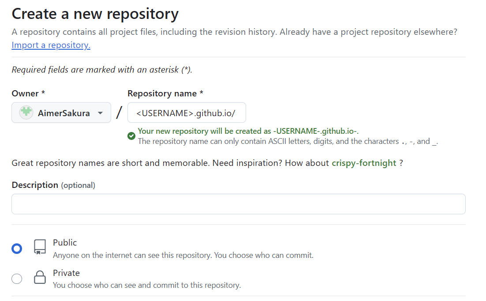
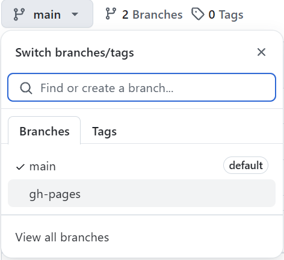
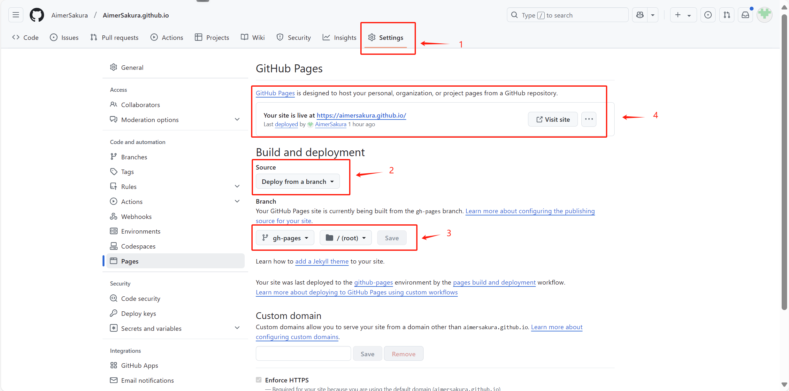
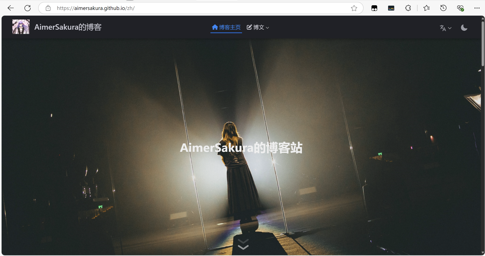

使用vuepress以及GitHub page搭建个人博客站
<!-- more -->
# 使用Vuepress框架搭建GitHub Page个人博客站

## 准备环境

### Node.js

前往Node.js官方网站下载并安装Node.js

[Node.js — 在任何地方运行 JavaScript](https://nodejs.org/zh-cn)

### VuePress Theme Hope

一个前端框架
运行以下命令，安装该框架

```
npm init vuepress-theme-hope@latest my-docs
```

这里的 my-docs 是一个参数，代表 VuePress Theme Hope 项目的文件夹名称


## 常用命令

- ```bash
  `vuepress dev <dir>` 
  ```

  会启动一个开发服务器，以便让你在本地开发你的 VuePress 站点。

- ```bash
  `vuepress build <dir>`
  ```

   会将你的 VuePress 站点构建成静态文件，以便你进行后续部署。

  "< dir >"就是项目文件夹名称，如 my-docs

对应命令：

```npm
npm run docs:dev 启动开发服务器
npm run docs:build 构建项目并输出
npm run docs:clean-dev 清除缓存并启动开发服务器
```


## 常用知识
**Frontmatter**

Frontmatter 是 VuePress 中很重要的一个概念，它用于承载 Markdown 文件的配置。

Frontmatter 必须在 Markdown 文件的顶部，并且被包裹在一对三短划线中间。下面用本文举一个示例:

```
#cover: /assets/images/cover2.jpg
icon: pen-to-square
date: 2025-01-23
category:
  - 配置教程
tag:
  - 教程
star: true
sticky: true
--------------------以上是Frontmatter配置-----------------------
cover    代表页面的预览图。
icon     代表当前页面图标的 FontClass 或文件路径。
date     代表写作时间，格式: YYYY-MM-DD 或 YYYY-MM-DD hh:mm:ss
category 代表分类。
tag      代表标签。
star	 代表是否标为星标文章。当填入数字时，数字越大，排名越靠前。
sticky   代表是否在列表中置顶。当填入数字时，数字越大，排名越靠前。
```

更多配置请看：https://theme-hope.vuejs.press/zh/config/frontmatter/


**`.vuepress` 文件夹**

VuePress 使用文档文件夹中的 `.vuepress` 文件夹存放配置，所有 VuePress 相关的文件都将会被放在这里。

常用的配置文件为 config.ts和 theme.ts

配置文件大全：

[配置 | VuePress](https://vuejs.press/zh/reference/config.html)

[主题 API | VuePress](https://vuejs.press/zh/reference/theme-api.html)


**VuePress 项目结构**

VuePress 只控制 VuePress 项目文件夹中的文件，也就是默认模板生成的 `src` 文件夹，项目下的其他文件不受 VuePress 控制。

一个基本的项目结构如下:

```
.
├── .github (可选的) → GitHub 配置文件存放路径
│    └── workflow → GitHub 工作流配置
│         └── docs-deploy.yml → 自动部署文档的工作流
│
├── src → 文档文件夹
│    │
│    ├── .vuepress (可选的) → VuePress 配置文件夹
│    │    │
│    │    ├── dist (默认的) → 构建输出目录
│    │    │
│    │    ├── public (可选的) → 静态资源目录
│    │    │
│    │    ├── styles (可选的) → 用于存放样式相关的文件
│    │    │
│    │    ├── config.{js,ts} (可选的) → 配置文件的入口文件
│    │    │
│    │    └── client.{js,ts} (可选的) → 客户端文件
│    │
│    ├── ... → 其他项目文档
│    │
│    └── README.md → 项目主页
│
└── package.json → Nodejs 配置文件
```


## 部署到GithubPage

当你在本地完成项目的初步开发后,你可以将项目的内容部署到你网站的服务器上。

**新建GitHub 项目**

新建一个GitHub项目命名为 **\<USERNAME\>.github.io/** 的格式



创建完毕后

将整个项目推送到GitHub

对应命令

```
# 初始化
git init
#创建.gitignore 文件
touch .gitignore
```

编辑.gitignore文件并上传GitHub

```
# .gitignore内容
dist
```

```
# 上传GitHub
# 项目所有文件添加到暂缓区
git add .
# 为这个提交添加一条简短的说明
git commit -m "忽略 dist 目录"
# 将当前分支（强制）重命名为main
git branch -M main
# 连接到远程仓库
git remote add origin https://github.com/<username>/<username>.git
# 将缓存内容推送到远程仓库中
git push -u origin main
```

**再次编辑.gitignore文件**

```
#dist
```

**使用 `npm docs:build` 命令构建网站。**

如果你在使用模板，网站内容将会输出到 VuePress 项目的 `.vuepress/dist` 文件夹下。这些文件就是 VuePress 的最终输出结果。

**单独上传dist文件夹**

```
git add .
git commit -m 'push dist'
// 将 dist 目录的内容推送到远程仓库的 gh-pages 分支（这个命令会创建对应分支，如果没有的话）
git subtree push --prefix my-docs/src/.vuepress/dist origin gh-pages

--prefix后面对应项目dist文件夹的路径
```

此时会有2个分支


进入项目的setting部分


按照图示步骤配置setting

最终网站地址会在第四个地方出现
此时网站部署就大功告成啦。


感谢阅读.